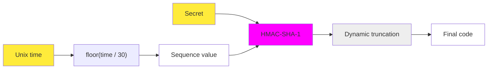
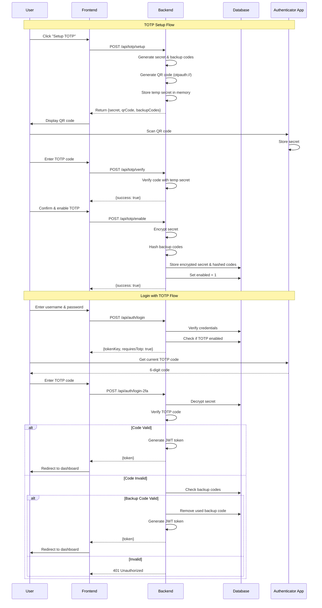

# TOTP (Time-based One-Time Password) Process

## Introduction

TOTP (Time-based One-Time Password) is a two-factor authentication (2FA) mechanism that adds an extra layer of security to user accounts. This implementation uses the **RFC 6238** standard, which generates time-based one-time passwords that change every 30 seconds.

### How TOTP Works

1. **Secret Generation**: A shared secret is generated and stored securely (encrypted) on the server
2. **QR Code**: The secret is encoded in a QR code using the `otpauth://` URI scheme
3. **Authenticator App**: Users scan the QR code with an authenticator app (Google Authenticator, Authy, etc.)
4. **Code Generation**: The app generates 6-digit codes every 30 seconds based on the current time and secret
5. **Verification**: During login, users enter the current code, which is verified against the server's calculation

### Key Components

- **Secret**: A base32-encoded string shared between server and authenticator app
- **Time Window**: Codes are valid for ±1 time step (30 seconds) to account for clock drift
- **Backup Codes**: One-time use codes generated during setup for account recovery
- **Encryption**: Secrets are encrypted at rest using AES-256

## Implementation Flow

### Security Features

- **Encrypted Storage**: Secrets are encrypted using AES-256 before storing in database
- **Hashed Backup Codes**: Backup codes are hashed with bcrypt (10 rounds)
- **Time-based Validation**: Codes expire after 30 seconds
- **Clock Drift Tolerance**: Accepts codes from ±1 time window
- **One-time Backup Codes**: Used backup codes are removed from database

## Sequence Diagram

