# TOTP (Time-based One-Time Password) Process

## Introduction

TOTP (Time-based One-Time Password) is a two-factor authentication (2FA) mechanism that adds an extra layer of security to user accounts. This implementation uses the **RFC 6238** standard, which generates time-based one-time passwords that change every 30 seconds.

### HOTP (HMAC-based One-Time Password)

HMAC (Hash-based Message Authentication Code) is a specific algorithm that combines a secret key and message using a cryptographic hash function to create a secure code for verification. The server validates codes using a **sequence window** to handle desynchronization between client and server counters.

```mermaid
flowchart TD
    subgraph ServerSequence["HOTP Server Sequence (Counter-based)"]
        direction LR
        C1["Code 1<br/>628051"] --> C2["Code 2<br/>798057<br/>👈 Server Expected"]
        C2 --> C3["Code 3<br/>648491"]
        C3 --> C4["Code 4<br/>469414"]
        C4 --> C5["Code 5<br/>527971"]
    end

    subgraph ClientCode["Client sequence"]
        direction LR
        V1["Sequence 2"] --> V2["Code 2<br/>798057"]
    end



    V2 -->  C2
    style C2 fill:#90EE90
    style V1 fill:#87CEEB
```

**Key Concepts:**

- **Server Counter (C_server)**: The server's expected counter position (e.g., Code 2 = 798057)
- **Client Code (C_client)**: The code submitted by the user's authenticator app (e.g., Code 7 = 372702)
- **Validation Window**: A range of acceptable codes (e.g., window: 5 means codes from C_server to C_server + 4)
- **Resynchronization**: If a valid code is found within the window, the server updates its counter to match the client's position
- **Security**: The window prevents valid codes from being rejected due to counter desynchronization, while still maintaining security by limiting the acceptable range

### TOTP Time-based One-Time Password

Requires the user to manually enter a short code generated on a device, which changes every ~30 seconds. It is simple, offline-capable, and resistant to push-fatigue attacks, but adds friction and is vulnerable to phishing if the code is entered into a fake site.

1. **Secret Generation**: A shared secret is generated and stored securely (encrypted) on the server
2. **QR Code**: The secret is encoded in a QR code using the `otpauth://` URI scheme
3. **Authenticator App**: Users scan the QR code with an authenticator app (Google Authenticator, Authy, etc.)
4. **Code Generation**: The app generates 6-digit codes every 30 seconds based on the current time and secret
5. **Verification**: During login, users enter the current code, which is verified against the server's calculation

### Key Components

- **Secret**: A base32-encoded string shared between server and authenticator app
- **Time Window**: Codes are valid for ±1 time step (30 seconds) to account for clock drift.
  Synchronization of device clocks is handled via the [NTP (Network Time Protocol)](https://datatracker.ietf.org/doc/html/rfc5905), which ensures all devices use a consistent, real-world time reference.
- **Backup Codes**: One-time use codes generated during setup for account recovery
- **Encryption**: Secrets are encrypted at rest using AES-256

## Implementation Flow

### Security Features

- **Encrypted Storage**: Secrets are encrypted using AES-256 before storing in database
- **Hashed Backup Codes**: Backup codes are hashed with bcrypt (10 rounds)
- **Time-based Validation**: Codes expire after 30 seconds
- **Clock Drift Tolerance**: Accepts codes from ±1 time window
- **One-time Backup Codes**: Used backup codes are removed from database
- **Rate Limiting**: TOTP endpoints have to be rate-limited to prevent brute force attacks and abuse.
- **Replay Protection**: Prevents replaying TOTP codes within the same time window, ensuring each code can only be used once.
- **Transport Security**: All TOTP requests and responses should be sent over secure HTTPS connections to prevent interception.
- **Audit Logging**: All critical TOTP actions (enable/disable, verification attempts, backup code regeneration) should be logged for security monitoring and incident response.
- **Password Confirmation**: Disabling TOTP or regenerating backup codes should require password re-entry to prevent abuse if the session is hijacked.
- **User Alerts**: Notify users via email or notifications when TOTP is enabled, disabled, or backup codes are regenerated to quickly alert them of potential unauthorized changes.

## Sequence Diagram

### Recommended recovery process for lost TOTP + backup codes

### FAQ

**Q: What the backup codes are used for?**  
A: One-time recovery codes generated during TOTP setup. Used when the authenticator device is unavailable (lost, stolen, or broken). Each code can only be used once.

**Q: How are backup codes generated and stored securely?**  
A: Generated as random 8-character alphanumeric strings. Stored hashed with bcrypt (10 rounds) in the database. Plain codes shown once during setup, then never stored in plaintext.

**Q: What happens when all backup codes are used up?**  
A: User must regenerate new backup codes (requires TOTP verification) or use account recovery process. Consider allowing regeneration before codes are exhausted.

**Q: What's the process for lost device, which had a TOTP setup already in an auth app?**  
A: User can use backup codes to log in, then disable old TOTP and set up a new one. Alternatively, use account recovery process with identity verification.
MFA Login endpoint has to check backup codes only as fallout.
Only one backup code can be used per login attempt. Each backup code is designed to be single-use—after a valid code is used, it is removed from the user's list in the database.

**Q: How do we handle account recovery when both device and backup codes are lost?**  
A: Require alternative verification: email confirmation, SMS verification, security questions, or admin-assisted recovery with identity proof. This is a critical security decision.

**Q: What fallback MFA scenario is preferred to get implemented?**  
A: The primary fallback is backup codes generated during TOTP setup, allowing login if TOTP access is lost. Additional options can include SMS or email-based verification, where the user receives a code or a special link. Enterprise environments might also allow admin-assisted recovery after additional identity checks.

- Can the email link token reuse the current TOTP code?  
  TOTP codes are meant to be entered manually and are only valid for ~30 seconds. The user might not receive or click the email in time, resulting in an expired code.  
  Instead, best practice is to generate a separate, random, and longer-lived token (e.g., valid for 10–15 minutes) for the email link, unrelated to TOTP codes or the TOTP secret. An example of such a link structure would be:  
  `https://your-app.example.com/verify-mfa?token=UNIQUE_EMAIL_TOKEN`

**Q: How should the lost password process affect TOTP MFA? **
A: During a lost password or recovery process, require users to complete additional MFA if possible (TOTP or a backup code) to confirm their identity before allowing a password change.
After successful recovery and password change, prompt or require the user to set up a new TOTP secret, and invalidate/disable the previous TOTP registration (and generate new backup codes). This prevents persistence of old MFA factors after recovery, ensuring account security.

**Q: Should the TOTP secret be rotated after a password change or lost password event? **
A: Yes, it is strongly recommended to rotate (regenerate) the TOTP secret after a password reset caused by a suspected or confirmed compromise, such as a lost password. This ensures that if an attacker had access to both the password and the current TOTP secret, they can no longer access the account after the reset.

**Q: What are the best practices for secret rotation and regeneration?**  
A: Allow users to regenerate secrets when needed (device lost, suspected compromise). Old secret is immediately invalidated. Require password verification before regeneration.

**Q: Can a user have multiple TOTP secrets active at once?**  
A: Typically no—one active secret per user. Enabling a new secret should disable the previous one. Multiple secrets would create confusion and security issues.

**Q: Can TOTP be disabled after setup, and what is the process?**  
A: Yes, through a disable endpoint that requires password verification. The encrypted secret and backup codes are removed from the database.

**Q: What is the recommended approach for enterprise deployments with multiple users?**  
A: Same TOTP process for all users. Add admin recovery options, audit logging, and policy enforcement (e.g., mandatory 2FA). Consider SSO integration.

**Q: Is it possible to configure the same 1 QR code into multiple auth apps (before regenerating and forcing new secret to be generated). Does it cause any vulnerabilities?**  
A: Yes, the same secret can be scanned into multiple apps. This is safe if all devices are trusted. It's actually convenient for redundancy, but increases risk if any device is compromised.

**Q: What is the security impact of sharing the same secret across multiple devices/apps?**  
A: No additional vulnerability if all devices are trusted. However, if any device is compromised, the attacker can generate valid codes. Each device is an additional attack surface.

**Q: What is the best practice to ensure TOTP is only used on one device only?**
A: There is no technical method to 100% prevent a user from scanning the TOTP QR code into multiple apps or devices, since the secret itself can be copied or reused.

**Q: How does clock synchronization work between the server and authenticator app?**  
A: Both independently calculate codes using Unix time (seconds since epoch). No direct synchronization needed—both use the same algorithm with current time divided by 30-second windows.

**Q: What happens if the user's device time is incorrect or out of sync?**  
A: Generated codes won't match server calculations. User must sync device time to correct timezone/NTP. Server accepts ±1 time window (30 seconds) to handle minor drift.
Our current TOTP verification function is configured to accept codes from the current time window plus one adjacent time window before and after (±1 window). This provides tolerance for minor clock drift between client and server.

**Q: What happens if a user tries to use an expired TOTP code?**  
A: Code is rejected. User must enter the current code from their authenticator app. Server only accepts codes from current or adjacent time windows.

**Q: How do we prevent replay attacks with TOTP codes?**  
A: Codes expire after 30 seconds, making replay windows very short. Optionally track recently used codes per time window to prevent reuse within the same period.

**Q: Should we implement rate limiting for TOTP verification attempts?**  
A: Yes, implement rate limiting (e.g., 3 attempts per 15 minutes) to prevent brute force attacks. Lock account temporarily after repeated failures.

# Other alternatives and considerations

## One-tap (push) authentication

It sends a login request to a trusted device where the user approves it with a single tap (often with biometrics). It offers superior usability and phishing resistance when implemented with cryptographic challenge-response, but depends on network availability and is vulnerable to approval fatigue if poorly protected.

### Steps:

- User initiates login
- Server sends a push challenge to device
- User taps Approve (optionally biometric)
- Device signs the challenge → access granted

| Aspect              | TOTP              | One-tap (Push)              |
| ------------------- | ----------------- | --------------------------- |
| User effort         | Manual code entry | Single tap                  |
| Offline support     | Yes               | No                          |
| Phishing resistance | Medium            | High (when challenge-based) |
| Push-fatigue risk   | None              | Yes (if not mitigated)      |
| UX                  | Moderate friction | Very smooth                 |
